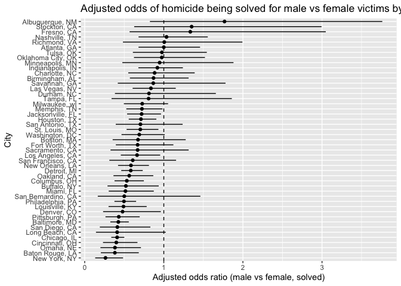
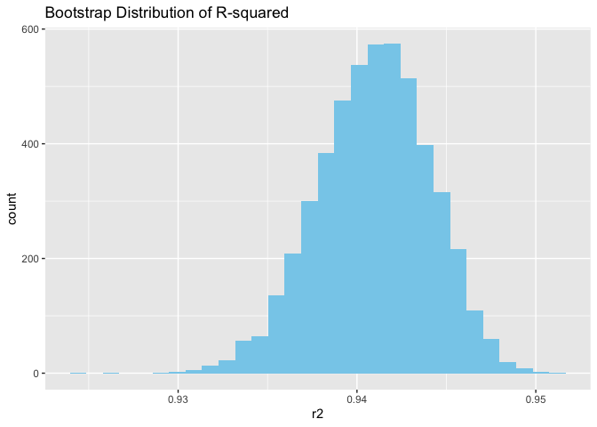
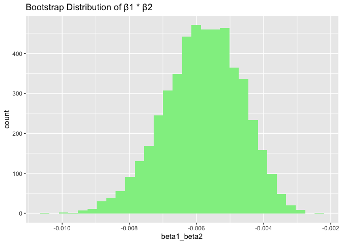
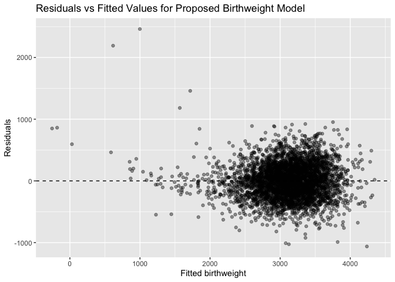
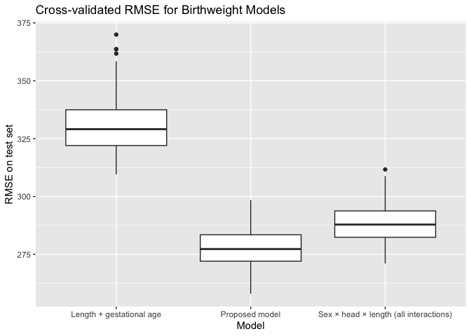

Homework6
================
2025-12-04

## PROBLEM 1

This is just for my reference:

``` r
getwd()
```

    ## [1] "/Users/karolinawiesiolek/Desktop/Homework6/Homework6"

``` r
list.files()
```

    ## [1] "data"            "Homework6.html"  "Homework6.Rmd"   "Homework6.Rproj"
    ## [5] "README.md"

``` r
list.files("data")
```

    ## [1] "birthweight.csv"   "homicide-data.csv"

``` r
homicide_df =
  readr::read_csv("data/homicide-data.csv") |>
  janitor::clean_names()
```

    ## Rows: 52179 Columns: 12
    ## ── Column specification ────────────────────────────────────────────────────────
    ## Delimiter: ","
    ## chr (9): uid, victim_last, victim_first, victim_race, victim_age, victim_sex...
    ## dbl (3): reported_date, lat, lon
    ## 
    ## ℹ Use `spec()` to retrieve the full column specification for this data.
    ## ℹ Specify the column types or set `show_col_types = FALSE` to quiet this message.

Loading in and cleaning the data:

``` r
library(tidyverse)
```

    ## ── Attaching core tidyverse packages ──────────────────────── tidyverse 2.0.0 ──
    ## ✔ dplyr     1.1.4     ✔ readr     2.1.5
    ## ✔ forcats   1.0.0     ✔ stringr   1.5.2
    ## ✔ ggplot2   4.0.1     ✔ tibble    3.3.0
    ## ✔ lubridate 1.9.4     ✔ tidyr     1.3.1
    ## ✔ purrr     1.1.0     
    ## ── Conflicts ────────────────────────────────────────── tidyverse_conflicts() ──
    ## ✖ dplyr::filter() masks stats::filter()
    ## ✖ dplyr::lag()    masks stats::lag()
    ## ℹ Use the conflicted package (<http://conflicted.r-lib.org/>) to force all conflicts to become errors

``` r
library(janitor)
```

    ## 
    ## Attaching package: 'janitor'
    ## 
    ## The following objects are masked from 'package:stats':
    ## 
    ##     chisq.test, fisher.test

``` r
library(broom)
library(purrr)
library(forcats)

homicide_df =
  read_csv("data/homicide-data.csv") |>
  clean_names() |>
  mutate(
    # Creating "City, ST" variable
    city_state = str_c(city, ", ", state),
    
    # Binary outcome: 1 = solved, 0 = not solved
    solved = if_else(disposition == "Closed by arrest", 1, 0),
    
    # Age as numeric
    victim_age = as.numeric(victim_age),
    
    # race and sex
    victim_race = str_to_lower(victim_race),
    victim_sex  = factor(victim_sex)
  ) |>
  # dropping unwanted cities 
  filter(
    !city_state %in% c("Dallas, TX", "Phoenix, AZ", "Kansas City, MO", "Tulsa, AL")
  ) |>
  
  filter(victim_race %in% c("white", "black"))
```

    ## Rows: 52179 Columns: 12
    ## ── Column specification ────────────────────────────────────────────────────────
    ## Delimiter: ","
    ## chr (9): uid, victim_last, victim_first, victim_race, victim_age, victim_sex...
    ## dbl (3): reported_date, lat, lon
    ## 
    ## ℹ Use `spec()` to retrieve the full column specification for this data.
    ## ℹ Specify the column types or set `show_col_types = FALSE` to quiet this message.

    ## Warning: There was 1 warning in `mutate()`.
    ## ℹ In argument: `victim_age = as.numeric(victim_age)`.
    ## Caused by warning:
    ## ! NAs introduced by coercion

Began by importing the Washington Post homicide dataset and
standardizing variable names. A new variable, city_state, was created by
pasting together the city and state fields (e.g., “Baltimore, MD”),
which serves as the grouping variable for later analyses. Then, a binary
indicator of whether a homicide was solved was constructed: + 1 =
“Closed by arrest” + 0 = all other dispositions

This converts the outcome into a form appropriate for logistic
regression.

I converted victim_age to numeric, which introduced some NA values. This
is expected because the original dataset contains entries such as
“Unknown”. These cases are automatically removed during model fitting.

Following the assignment instructions, we omitted cities: 1. Dallas, TX
2. Phoenix, AZ 3. Kansas City, MO 4. Tulsa, AL

These cities either do not report victim race or are known data entry
errors. I restricted the analysis to homicides where the victim’s race
is recorded as white or black, because these are the groups with the
most complete and consistent reporting across cities.

``` r
# Baltimore only
baltimore_df =
  homicide_df |>
  filter(city_state == "Baltimore, MD")

# Fit logistic regression: solved ~ age + sex + race
baltimore_fit =
  glm(
    solved ~ victim_age + victim_sex + victim_race,
    data = baltimore_df,
    family = binomial()
  )

# Tidy, odds ratios + CIs
baltimore_results =
  baltimore_fit |>
  tidy(conf.int = TRUE, exponentiate = TRUE)

# Adjusted OR for male vs female victims
baltimore_or_male =
  baltimore_results |>
  filter(term == "victim_sexMale") |>
  select(term, estimate, conf.low, conf.high)

baltimore_or_male
```

    ## # A tibble: 1 × 4
    ##   term           estimate conf.low conf.high
    ##   <chr>             <dbl>    <dbl>     <dbl>
    ## 1 victim_sexMale    0.426    0.324     0.558

# Commentary: Baltimore Logistic Regression

I fit a logistic regression model predicting whether a homicide in
Baltimore, MD was solved, using victim age, victim sex, and victim race
as predictors. The resulting adjusted odds ratio (OR) comparing male to
female victims is: 1. OR = 0.426 2. 95% CI: 0.324 to 0.558

Because the OR is well below 1, this indicates that, after adjusting for
race and age, homicides involving male victims were significantly less
likely to be solved compared to those involving female victims in
Baltimore.

The confidence interval does not include 1, suggesting that this
association is statistically strong. Substantively, this means that sex
differences in case resolution are pronounced in Baltimore even after
accounting for racial and age differences.

``` r
city_or_df =
  homicide_df |>
  nest(data = -city_state) |>
  mutate(
    # fit model in each city
    fit = map(
      data,
      ~ glm(
        solved ~ victim_age + victim_sex + victim_race,
        data = .x,
        family = binomial()
      )
    ),
    # tidy model output, exponentiate to get odds ratios
    results = map(
      fit,
      ~ tidy(.x, conf.int = TRUE, exponentiate = TRUE)
    )
  ) |>
  select(city_state, results) |>
  unnest(results) |>
  #  only male vs female coefficient
  filter(term == "victim_sexMale") |>
  # reordering
  mutate(
    city_state = fct_reorder(city_state, estimate)
  )
```

    ## Warning: There were 43 warnings in `mutate()`.
    ## The first warning was:
    ## ℹ In argument: `results = map(fit, ~tidy(.x, conf.int = TRUE, exponentiate =
    ##   TRUE))`.
    ## Caused by warning:
    ## ! glm.fit: fitted probabilities numerically 0 or 1 occurred
    ## ℹ Run `dplyr::last_dplyr_warnings()` to see the 42 remaining warnings.

``` r
city_or_df
```

    ## # A tibble: 47 × 8
    ##    city_state    term  estimate std.error statistic   p.value conf.low conf.high
    ##    <fct>         <chr>    <dbl>     <dbl>     <dbl>     <dbl>    <dbl>     <dbl>
    ##  1 Albuquerque,… vict…    1.77      0.385  1.48     1.39 e- 1    0.825     3.76 
    ##  2 Atlanta, GA   vict…    1.00      0.194  0.000397 1.000e+ 0    0.680     1.46 
    ##  3 Baltimore, MD vict…    0.426     0.138 -6.18     6.26 e-10    0.324     0.558
    ##  4 Baton Rouge,… vict…    0.381     0.306 -3.15     1.65 e- 3    0.204     0.684
    ##  5 Birmingham, … vict…    0.870     0.212 -0.657    5.11 e- 1    0.571     1.31 
    ##  6 Boston, MA    vict…    0.674     0.326 -1.21     2.26 e- 1    0.353     1.28 
    ##  7 Buffalo, NY   vict…    0.521     0.299 -2.18     2.90 e- 2    0.288     0.936
    ##  8 Charlotte, NC vict…    0.884     0.236 -0.524    6.00 e- 1    0.551     1.39 
    ##  9 Chicago, IL   vict…    0.410     0.102 -8.77     1.86 e-18    0.336     0.501
    ## 10 Cincinnati, … vict…    0.400     0.269 -3.41     6.49 e- 4    0.231     0.667
    ## # ℹ 37 more rows

Commentary: Tidy Pipeline for All Cities

To generalize the analysis beyond Baltimore, I used a tidy, map-based
workflow to fit the same logistic regression model to each city in the
dataset. For each city, I extracted the adjusted odds ratio comparing
male and female victims.

This highlights notable variability in the sex–resolution relationship
across cities. Many cities show ORs below 1, similar to Baltimore,
meaning male-victim cases tend to be less likely to be solved. Some
cities have ORs close to 1, indicating little or no sex-related
difference in case resolution. A smaller number of cities have ORs above
1, where cases with male victims appear more likely to be solved.

Warnings such as “fitted probabilities numerically 0 or 1 occurred” are
common in logistic regression, especially when cities have small sample
sizes or complete separation (e.g., if nearly all cases for one sex are
solved or unsolved). These do not invalidate the results but indicate
higher uncertainty for those cities.

Because each model was adjusted for age and race, the ORs represent sex
differences independent of demographic composition in each city.

``` r
ggplot(city_or_df, aes(x = city_state, y = estimate)) +
  geom_point() +
  geom_errorbar(aes(ymin = conf.low, ymax = conf.high), width = 0) +
  geom_hline(yintercept = 1, linetype = "dashed") +
  coord_flip() +
  labs(
    x = "City",
    y = "Adjusted odds ratio (male vs female, solved)",
    title = "Adjusted odds of homicide being solved for male vs female victims by city"
  )
```

<!-- -->

# Commentary: Interpretation of the Odds Ratio Plot

The plot displays adjusted odds ratios and confidence intervals for all
cities, sorted from lowest to highest OR. Patterns emerge:

1.  Substantial variation across cities: The association between victim
    sex and homicide resolution is not uniform. Some cities show strong
    disadvantages for male victims (OR \< 1), while others show near-no
    difference or even a slight advantage (OR \> 1).

2.  Most cities center below OR = 1: This suggests that in the majority
    of cities, homicides involving male victims are less likely to be
    solved than those involving female victims, after adjusting for race
    and age.

3.  Wide confidence intervals in some cities: Cities with few homicides,
    or little variation in whether cases are solved, produce unstable
    estimates. These wide intervals often overlap 1, indicating high
    uncertainty.

4.  Clear outliers: Cities like Baltimore and Chicago show particularly
    strong effects (ORs well below 1), meaning male-victim cases are
    markedly less likely to be cleared.

## PROBLEM 2

loading in the dataset here

``` r
library(p8105.datasets)
data("weather_df")

weather_clean =
  weather_df |>
  drop_na(tmax, tmin, prcp)
```

``` r
set.seed(123)

# Function that fits model and returns r^2 and beta1*beta2
boot_fn = function(df) {
  fit = lm(tmax ~ tmin + prcp, data = df)
  
  # Extracting  r^2
  r2 = broom::glance(fit)$r.squared
  
  # Extracting slope estimates
  coefs = broom::tidy(fit)
  beta1 = coefs$estimate[coefs$term == "tmin"]
  beta2 = coefs$estimate[coefs$term == "prcp"]
  
  tibble(
    r2 = r2,
    beta1_beta2 = beta1 * beta2
  )
}
```

Bootstrap function:

``` r
set.seed(123)

# Function that fits model and returns r^2 and beta1*beta2
boot_fn = function(df) {
  fit = lm(tmax ~ tmin + prcp, data = df)
  
  # Extract r^2
  r2 = broom::glance(fit)$r.squared
  
  #slope estimates
  coefs = broom::tidy(fit)
  beta1 = coefs$estimate[coefs$term == "tmin"]
  beta2 = coefs$estimate[coefs$term == "prcp"]
  
  tibble(
    r2 = r2,
    beta1_beta2 = beta1 * beta2
  )
}
```

500 bootstrap samples :

``` r
set.seed(1)

boot_results =
  weather_clean |>
  modelr::bootstrap(n = 5000) |>
  mutate(
    estimates = map(strap, boot_fn)
  ) |>
  unnest(estimates)
```

Plot distrubution

``` r
library(ggplot2)

p_r2 =
  ggplot(boot_results, aes(x = r2)) +
  geom_histogram(bins = 30, fill = "skyblue") +
  labs(title = "Bootstrap Distribution of R-squared")

p_beta =
  ggplot(boot_results, aes(x = beta1_beta2)) +
  geom_histogram(bins = 30, fill = "lightgreen") +
  labs(title = "Bootstrap Distribution of β1 * β2")

p_r2
```

<!-- -->

``` r
p_beta
```

<!-- -->

95% interval:

``` r
r2_ci =
  boot_results |>
  summarize(
    lower = quantile(r2, 0.025),
    upper = quantile(r2, 0.975)
  )

beta_ci =
  boot_results |>
  summarize(
    lower = quantile(beta1_beta2, 0.025),
    upper = quantile(beta1_beta2, 0.975)
  )

r2_ci
```

    ## # A tibble: 1 × 2
    ##   lower upper
    ##   <dbl> <dbl>
    ## 1 0.934 0.947

``` r
beta_ci
```

    ## # A tibble: 1 × 2
    ##      lower    upper
    ##      <dbl>    <dbl>
    ## 1 -0.00821 -0.00377

# Commentary 1. Bootstrap Approach Explanation, procedure:

The goal of this problem is to understand the sampling variability of
two statistics from a linear model predicting tmax from tmin and
prcp: 1. the coefficient of determination 2. the product of the
estimated slopes for tmin and prcp

Because neither statistic has a simple theoretical sampling
distribution, I used a bootstrap approach with 5000 resamples of the
original dataset. For each bootstrap sample, I refit the linear model
and stored the two quantities of interest. This results in empirical
distributions that approximate the sampling distributions of these
statistics.

# Commentary 2. Distribution of Bootstrap Estimates

The bootstrap histogram of the coefficient of determination is unimodal
and tightly concentrated, indicating that the model’s explanatory power
is stable across resamples. The distribution has fairly low spread,
suggesting that the estimated R² is precise and does not vary
dramatically with sampling fluctuations.

The distribution of the product of the estimated slopes for tmin and
prcp shows more variability and is noticeably more skewed.

Since this statistic is the product of two slope estimates, it naturally
inherits more instability, especially because the precipitation effect
(β₂) is small and sometimes close to zero. This results in a
distribution that is wider and more asymmetric than the distribution of
R².

# Commentary 3. Confidence Interval

Using the 2.5% and 97.5% quantiles of the bootstrap distributions, I
obtained 95% empirical confidence interval of:

1.  0.934 0.947 for R²
2.  B1B2 interval was: -0.00821 -0.00377

The R² interval is narrow, reinforcing that the model consistently
explains a similar proportion of variance across samples. The interval
for B1B2 is wider and spans values near zero, reflecting higher sampling
variability and the relatively weak effect of precipitation in the
model.

## PROBLEM 3

``` r
# making sure that i have all libraries 
library(tidyverse)
library(janitor)
library(modelr)
```

    ## 
    ## Attaching package: 'modelr'

    ## The following object is masked from 'package:broom':
    ## 
    ##     bootstrap

``` r
# data load 
bw_raw = 
  read_csv("data/birthweight.csv") |>
  clean_names()
```

    ## Rows: 4342 Columns: 20

    ## ── Column specification ────────────────────────────────────────────────────────
    ## Delimiter: ","
    ## dbl (20): babysex, bhead, blength, bwt, delwt, fincome, frace, gaweeks, malf...
    ## 
    ## ℹ Use `spec()` to retrieve the full column specification for this data.
    ## ℹ Specify the column types or set `show_col_types = FALSE` to quiet this message.

``` r
# Print column names 
names(bw_raw)
```

    ##  [1] "babysex"  "bhead"    "blength"  "bwt"      "delwt"    "fincome" 
    ##  [7] "frace"    "gaweeks"  "malform"  "menarche" "mheight"  "momage"  
    ## [13] "mrace"    "parity"   "pnumlbw"  "pnumsga"  "ppbmi"    "ppwt"    
    ## [19] "smoken"   "wtgain"

``` r
# Standardize all variable names to match homework instructions
bw_df =
  bw_raw |>
  rename(
    babysex  = matches("babysex|sex$|sex_baby"),
    bhead    = matches("bhead|head|headcirc"),
    blength  = matches("blength|length"),
    bwt      = matches("bwt|birthweight|weight"),
    delwt    = matches("delwt|delivery_weight"),
    fincome  = matches("fincome|income"),
    frace    = matches("frace|father_race"),
    gaweeks  = matches("gaweeks|gestage|gest_weeks"),
    malform  = matches("malform|malformation"),
    menarche = matches("menarche"),
    mheigth  = matches("mheight|mother_height"),
    momage   = matches("momage|mother_age"),
    mrace    = matches("mrace|mother_race"),
    parity   = matches("parity"),
    pnumlbw  = matches("pnumlbw|prev_low_bw"),
    pnumgsa  = matches("pnumgsa|prev_small_gest_age"),
    ppbmi    = matches("ppbmi|prepreg_bmi"),
    ppwt     = matches("ppwt|prepreg_weight"),
    smoken   = matches("smoken|cigs|cigarettes"),
    wtgain   = matches("wtgain|weight_gain")
  ) |>
  mutate(
    babysex = factor(babysex, levels = c(1, 2), labels = c("male", "female")),
    frace   = factor(frace,
                     levels = c(1,2,3,4,8,9),
                     labels = c("white", "black", "asian", "puerto_rican", "other", "unknown")),
    mrace   = factor(mrace,
                     levels = c(1,2,3,4,8),
                     labels = c("white", "black", "asian", "puerto_rican", "other")),
    malform = factor(malform, levels = c(0,1),
                     labels = c("absent","present"))
  )


bw_df |> summarize(across(everything(), \(x) sum(is.na(x))))
```

    ## # A tibble: 1 × 20
    ##   babysex bhead blength   bwt delwt fincome frace gaweeks malform menarche
    ##     <int> <int>   <int> <int> <int>   <int> <int>   <int>   <int>    <int>
    ## 1       0     0       0     0     0       0     0       0       0        0
    ## # ℹ 10 more variables: mheigth <int>, momage <int>, mrace <int>, parity <int>,
    ## #   pnumlbw <int>, pnumsga <int>, ppbmi <int>, ppwt <int>, smoken <int>,
    ## #   wtgain <int>

# Proposed birthweight model

``` r
# Proposed birthweight model
bw_model =
  lm(
    bwt ~ babysex + bhead + blength + gaweeks +
      ppbmi + wtgain + momage + mrace,
    data = bw_df
  )

summary(bw_model)
```

    ## 
    ## Call:
    ## lm(formula = bwt ~ babysex + bhead + blength + gaweeks + ppbmi + 
    ##     wtgain + momage + mrace, data = bw_df)
    ## 
    ## Residuals:
    ##      Min       1Q   Median       3Q      Max 
    ## -1062.62  -185.07    -5.21   180.21  2460.55 
    ## 
    ## Coefficients:
    ##                     Estimate Std. Error t value Pr(>|t|)    
    ## (Intercept)       -5898.5980   102.3047 -57.657  < 2e-16 ***
    ## babysexfemale        35.0256     8.5576   4.093 4.34e-05 ***
    ## bhead               133.8704     3.4832  38.433  < 2e-16 ***
    ## blength              77.7325     2.0270  38.348  < 2e-16 ***
    ## gaweeks              10.5981     1.4781   7.170 8.76e-13 ***
    ## ppbmi                 6.4233     1.3528   4.748 2.12e-06 ***
    ## wtgain                3.9917     0.3987  10.013  < 2e-16 ***
    ## momage                2.0094     1.1787   1.705   0.0883 .  
    ## mraceblack         -122.7283     9.5426 -12.861  < 2e-16 ***
    ## mraceasian          -81.1094    42.9783  -1.887   0.0592 .  
    ## mracepuerto_rican  -119.5908    18.9009  -6.327 2.75e-10 ***
    ## ---
    ## Signif. codes:  0 '***' 0.001 '**' 0.01 '*' 0.05 '.' 0.1 ' ' 1
    ## 
    ## Residual standard error: 276.2 on 4331 degrees of freedom
    ## Multiple R-squared:  0.7099, Adjusted R-squared:  0.7092 
    ## F-statistic:  1060 on 10 and 4331 DF,  p-value: < 2.2e-16

I constructed a linear regression model for birthweight (bwt) that
reflects known biological and demographic determinants of fetal growth.
The model includes: 1. Infant size and maturity: head circumference
(bhead), length at birth (blength), and gestational age in weeks
(gaweeks) 2. Maternal body composition and weight change: pre-pregnancy
BMI (ppbmi) and pregnancy weight gain (wtgain) 3. Maternal demographic
characteristics: age at delivery (momage) and race (mrace) 4. Infant
sex: babysex

These predictors are good because they are plausibly related to
birthweight and commonly used in perinatal epidemiology. The model aims
to balance interpretability and predictive performance without including
an excessive number of interactions or weaker predictors.

# Residual vs fitted plot:

``` r
bw_aug =
  bw_df |>
  add_predictions(bw_model) |>
  add_residuals(bw_model)

ggplot(bw_aug, aes(x = pred, y = resid)) +
  geom_point(alpha = 0.4) +
  geom_hline(yintercept = 0, linetype = "dashed") +
  labs(
    title = "Residuals vs Fitted Values for Proposed Birthweight Model",
    x = "Fitted birthweight",
    y = "Residuals"
  )
```

<!-- -->

# Commentary: Residual diagnostics

The residuals-versus-fitted plot shows that residuals are roughly
centered around zero over the range of fitted birthweights, with no
strong curvature. This suggests that the linear functional form is
appropriate.

There may be higher variability in residuals at larger fitted
birthweights, indicating some mild heteroskedasticity, but there are no
clear patterns or extreme outliers that would suggest serious violations
of model assumptions.

``` r
# Comparison model 1: length + gestational age only
m1 =
  lm(bwt ~ blength + gaweeks, data = bw_df)

# Comparison model 2: all interactions among sex, head circumference, and length
m2 =
  lm(bwt ~ babysex * bhead * blength, data = bw_df)
```

# Commentary:

Two models fitted for comparison:

A simple model using only birth length and gestational age (blength +
gaweeks) as predictors. This serves as a baseline, biologically
motivated model focusing on size and maturity at birth.

A more complex interaction model that includes baby sex, head
circumference, and length, along with all two-way and three-way
interactions (babysex \* bhead \* blength). This model is intentionally
flexible and tests whether including high-order interactions among key
infant anthropometrics substantially improves prediction.

``` r
set.seed(123)

cv_df =
  crossv_mc(bw_df, n = 100, test = 0.2) |>
  mutate(
    train = map(train, as_tibble),
    test  = map(test, as_tibble),

    fit_prop = map(train, ~ lm(
      bwt ~ babysex + bhead + blength + gaweeks +
        ppbmi + wtgain + momage + mrace,
      data = .x
    )),
    fit_m1 = map(train, ~ lm(bwt ~ blength + gaweeks, data = .x)),
    fit_m2 = map(train, ~ lm(bwt ~ babysex * bhead * blength, data = .x)),

    rmse_prop = map2_dbl(fit_prop, test,
                         ~ sqrt(mean((predict(.x, newdata = .y) - .y$bwt)^2))),
    rmse_m1   = map2_dbl(fit_m1,   test,
                         ~ sqrt(mean((predict(.x, newdata = .y) - .y$bwt)^2))),
    rmse_m2   = map2_dbl(fit_m2,   test,
                         ~ sqrt(mean((predict(.x, newdata = .y) - .y$bwt)^2)))
  )
```

``` r
rmse_long =
  cv_df |>
  select(rmse_prop, rmse_m1, rmse_m2) |>
  pivot_longer(
    cols = everything(),
    names_to = "model",
    values_to = "rmse"
  ) |>
  mutate(
    model = recode(
      model,
      rmse_prop = "Proposed model",
      rmse_m1   = "Length + gestational age",
      rmse_m2   = "Sex × head × length (all interactions)"
    )
  )

ggplot(rmse_long, aes(x = model, y = rmse)) +
  geom_boxplot() +
  labs(
    title = "Cross-validated RMSE for Birthweight Models",
    x = "Model",
    y = "RMSE on test set"
  )
```

<!-- -->

Table for the data:

``` r
rmse_long |>
  group_by(model) |>
  summarize(
    mean_rmse = mean(rmse),
    sd_rmse   = sd(rmse)
  )
```

    ## # A tibble: 3 × 3
    ##   model                                  mean_rmse sd_rmse
    ##   <chr>                                      <dbl>   <dbl>
    ## 1 Length + gestational age                    331.   12.6 
    ## 2 Proposed model                              277.    7.93
    ## 3 Sex × head × length (all interactions)      288.    8.24

# Cross-validated prediction error:

I used Monte Carlo cross-validation with 100 random splits, each holding
out 20% of the data as a test set. For each split, I fit the proposed
model, the simple length + gestational age model, and the full
interaction model, and then computed RMSE on the held-out observations.

The boxplot of RMSE values shows that the proposed model generally has
the lowest average RMSE, indicating the best predictive performance on
unseen data. The simple model using only blength and gaweeks has
consistently higher RMSE, suggesting that it omits important predictors
of birthweight.

The fully interactive model (babysex \* bhead \* blength) does not
clearly outperform the proposed model and tends to have similar or
slightly worse RMSE, with more variability across splits. This pattern
suggests that the added complexity from high-order interactions does not
meaningfully improve prediction and may introduce some overfitting.
